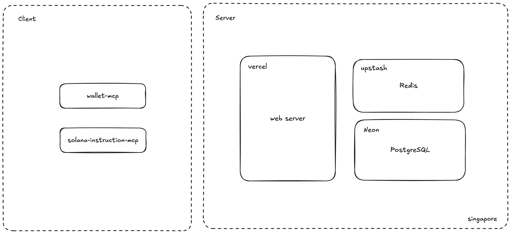

# TokenPocket MCP Monorepo

# Architecture

## APP

### mcp-web

TokenPocket MCP 的 DApp，wallet mcp 调用这个 Dapp 完成签名和获取用户钱包地址的功能。

DApp 未来还会支持

1. 在 web 上作为一个 AI Client 调用 MCP
2. MCP 市场

### wallet-mcp

链接 DApp ，支持用户在 AI Client

1. 查询自己的 address
2. 签名交易和消息

#### get-wallet

#### signature

### solana-instruction-mcp

构建 solana 交易的 mcp，支持

1. 构建发送 sol 的交易

## Package

一些在 APP 共用的库和抽象定义。

### database

drizzle orm

### solana

操作 solana 的 sdk

### trpc

DApp 的 API 实现，基于 tRPC

## Script

构建/部署的脚本

# Deployment

打 tag 发布生产制品

`wallet-mcp@x.x.x`：发布 wallet-mcp 到 npm

`solana-instruction-mcp@x.x.x`：发布 solana-instruction-mcp 到 npm
