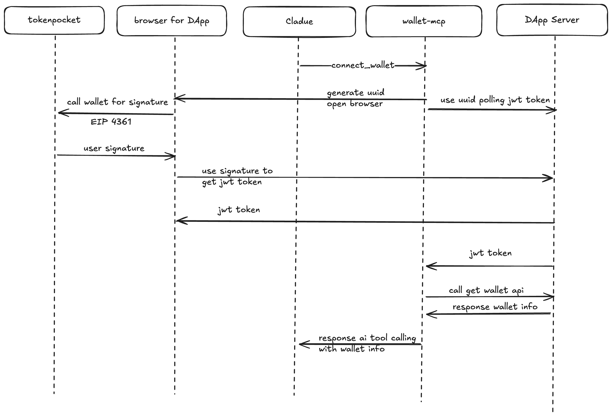
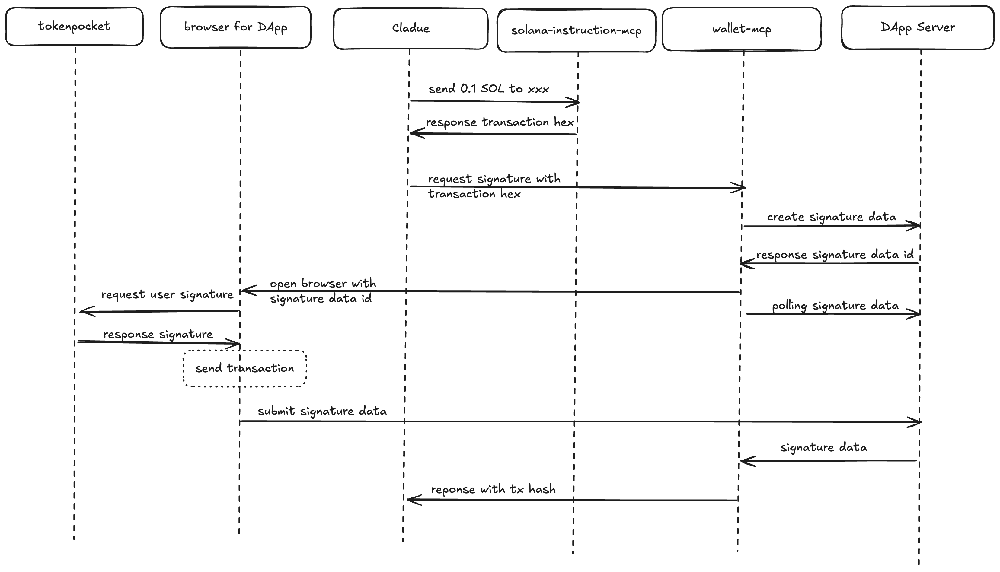

# TokenPocket MCP

## APP

### mcp-web

TokenPocket MCP 的 DApp，wallet mcp 调用这个 Dapp 完成签名和获取用户钱包地址的功能。

### wallet-mcp

链接 DApp ，支持用户在 AI Client 

1. 查询自己的 address
2. 签名交易和消息

#### get-wallet

#### signature

### solana-instruction-mcp

构建 solana 交易的 mcp，支持

1. 构建发送 sol 的交易

## Package
